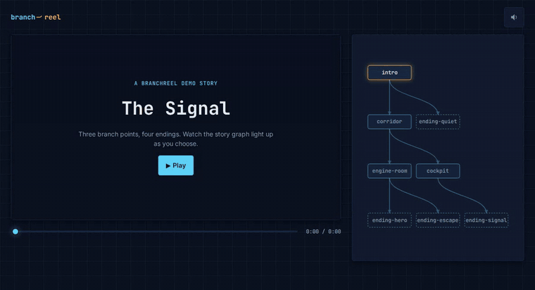

# Branchreel

**▶ Live demo: [apps.charliekrug.com/branchreel](https://apps.charliekrug.com/branchreel/)**

[](https://github.com/ctkrug/branchreel/actions/workflows/ci.yml)
[](LICENSE)

Branching video on a page you control. Describe a story as a JSON graph, hand Branchreel a
`<video>` element, and viewers click to choose what happens next. No proprietary format, no
hosted platform, no backend.



## Why

Interactive video usually comes down to two trades you may not want to make. Adopt a hosted
platform and the story lives in someone else's editor, someone else's file format, and someone
else's player, on their pricing. Build it yourself and you are hand-rolling source swapping,
choice overlays, preloading, and a scrubber that understands branches, once per project.

Branchreel is the small third option: a library you drop into a page you already own. The graph
is plain JSON you can write by hand, the media is a plain video file, and every decision runs in
the browser.

## What you get

- **A story is a state machine.** Nodes are video segments, choices are the edges between them.
  `BranchStateMachine` owns traversal and nothing else, so it runs fine with no DOM at all.
- **The cut does not stall.** Every choice target starts preloading as soon as its node begins
  playing, and `choose()` sets the host's `src` synchronously, so nothing is awaited between the
  click and the new frame.
- **Bad graphs fail at construction.** A duplicate node id, or a choice pointing at a node that
  is not in the graph, throws when you build the machine rather than three clicks into a
  playthrough.
- **A scrubber that tells the truth.** A branching story is not one timeline, so position is
  reported within the current segment instead of pretending the whole graph is a straight line.
- **Layout for the story graph.** `computeGraphLayout` returns node positions and edges; you draw
  them however you like. The demo renders SVG, the library has no opinion.
- **Zero runtime dependencies**, ESM and CJS builds, and TypeScript types in the package.

## Install

```sh
npm install branchreel
```

## Usage

Describe your story as a `BranchGraph`, then hand a `<video>` element and the graph to
`PlayerController`:

```ts
import { PlayerController, type BranchGraph } from "branchreel";

const graph: BranchGraph = {
  start: "intro",
  nodes: [
    {
      id: "intro",
      src: "intro.mp4",
      end: 8, // seconds into intro.mp4 where playback pauses for a choice
      choices: [
        { id: "brave", label: "Open the door", target: "hallway" },
        { id: "cautious", label: "Turn back", target: "ending-safe" },
      ],
    },
    { id: "hallway", src: "hallway.mp4" }, // no `choices` => terminal node
    { id: "ending-safe", src: "ending-safe.mp4" },
  ],
};

const video = document.querySelector("video")!;
const player = new PlayerController(video, graph);

player.addEventListener("choice", (event) => {
  const { choices } = (event as CustomEvent).detail;
  // render `choices` as buttons; each calls player.choose(choice.id)
});

player.addEventListener("branch", (event) => {
  const { node, history } = (event as CustomEvent).detail;
  // the cut already happened: video.src is node.src. Update your UI here.
});

player.addEventListener("end", (event) => {
  const { history } = (event as CustomEvent).detail;
  // reached a terminal node; history is the full path taken
});
```

`PlayerController` preloads every reachable choice target as soon as its node starts playing, so
`choose()` does not wait on the network. If a preload fails, choosing that branch still works
through a normal load instead of throwing.

Call `player.reset()` to return to the start node and clear history, which is what a "play again"
button wants. It reuses the same host and listeners, so there is no need to rebuild the
controller. Pass `true` to start playing straight away (`player.reset(true)`).

### Rendering the story graph

`computeGraphLayout` turns a `BranchGraph` into node positions and edges you can draw yourself in
SVG, canvas, or anything else. Each node's column is its shortest-path distance from `start`:

```ts
import { computeGraphLayout } from "branchreel";

const layout = computeGraphLayout(graph);
// layout.nodes: { id, x, y }[]
// layout.edges: { from, to, choiceId, label }[]
// layout.width / layout.height: the canvas size needed to draw it
```

### Using the state machine directly

`PlayerController` is built on `BranchStateMachine`, which stands alone if you are driving
playback yourself (no `<video>` element, or no browser at all):

```ts
import { BranchStateMachine } from "branchreel";

const machine = new BranchStateMachine(graph);
machine.current; // the current BranchNode
machine.choose("brave"); // moves to "hallway", returns the new BranchNode
machine.history; // ["intro", "hallway"]
```

Construction validates the graph up front, so a duplicate node id or a choice targeting an
unknown node throws immediately rather than failing later on `choose()`.

## Graph JSON shape

| Field | Type | Notes |
|---|---|---|
| `start` | `string` | Id of the node playback begins at |
| `nodes` | `BranchNode[]` | Every node in the story |
| `node.id` | `string` | Unique within the graph |
| `node.src` | `string` | Video source URL for this segment |
| `node.start?` | `number` | Start offset in seconds (default 0) |
| `node.end?` | `number` | End offset in seconds; omit to play to the media's natural end |
| `node.choices?` | `BranchChoice[]` | Omit or leave empty for a terminal node |
| `choice.id` | `string` | Unique within the node's `choices` |
| `choice.label` | `string` | Text shown on the choice prompt |
| `choice.target` | `string` | Id of the node this choice leads to |

## The demo story

`packages/playground` plays "The Signal": three branch points, four endings, eight segments. It
consumes the library exactly the way any integrator would, so it works as a full worked example
alongside the docs. The clips it ships are 3-second ffmpeg-generated placeholder cards (see
[`packages/playground/src/media/README.md`](packages/playground/src/media/README.md)); point each
node's `src` at real footage and nothing else in the app changes.

## Development

```sh
npm install
npm run build   # builds the library, then typechecks the playground against it
npm run test    # runs both packages' test suites
npm run --workspace=branchreel-playground dev   # live playground at localhost
```

[`docs/ARCHITECTURE.md`](docs/ARCHITECTURE.md) maps the codebase,
[`docs/VISION.md`](docs/VISION.md) covers why it exists, and
[`docs/DESIGN.md`](docs/DESIGN.md) is the demo's art direction.

## License

MIT, see [`LICENSE`](LICENSE).

---

More of Charlie's projects: [apps.charliekrug.com](https://apps.charliekrug.com)
